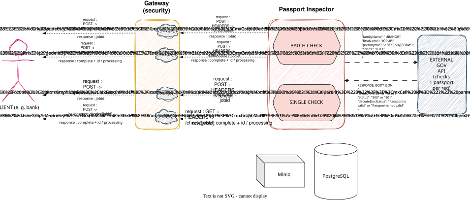

# Passport Inspector Platform

A microservices-based system for asynchronous passport data verification,
integrating with a mocked external SMEV service.

This is an umbrella repository: it does not contain service source code.
Each service lives in its own repository and is cloned separately for local
setup (see below).

## Services

| Repository                                                                               | Container                      | Role                                        | Stack                   | Port        |
|------------------------------------------------------------------------------------------|--------------------------------|---------------------------------------------|-------------------------|-------------|
| [ms-passport-inspector-gateway](https://github.com/NAIIIK/ms-passport-inspector-gateway) | ms-passport-inspector-gateway  | BFF / single entry point, issues JWTs       | Spring Boot             | 8082        |
| [ms-passport-inspector](https://github.com/NAIIIK/ms-passport-inspector)                 | ms-passport-inspector          | Core business logic, file storage via MinIO | Spring Boot, PostgreSQL | 8080        |
| [smev-api-mock](https://github.com/NAIIIK/smev-api-mock)                                 | smev-api-mock                  | Mock of the external SMEV service (REST)    | Spring Boot             | 8081        |
| - (infra)                                                                                | passport-minio                 | Object storage for uploaded CSV files       | MinIO                   | 9000 / 9001 |
| - (infra)                                                                                | passport-postgres              | Job, passport, and CSV task state           | PostgreSQL 15           | 5432        |
| - (infra)                                                                                | passport-prometheus            | Metrics scraping                            | Prometheus              | 9090        |
| - (infra)                                                                                | passport-grafana               | Metrics dashboards                          | Grafana                 | 3000        |

## Architecture



All external traffic enters through the **gateway**, which authenticates
requests and forwards them to the **core service** over an internal
OpenFeign client. The core service never accepts unauthenticated traffic,
and every request is scoped to the calling merchant.

**Request flow (single passport check):**
1. Client logs in against the gateway (`POST /api/auth/login`) and receives
   a short-lived JWT containing the caller's `merchantId` and roles.
2. Client calls the gateway with that JWT; the gateway forwards the request
   to `ms-passport-inspector`, which re-validates the JWT and checks that
   the `merchantId` header matches the token's claim.
3. The core service creates a `PENDING` job and passport record and returns
   immediately with a `jobId` - verification itself is asynchronous.
4. A background worker (`PassportVerificationProcessor`) polls for
   unprocessed passports, calls `smev-api-mock` to verify the document, and
   updates the job status.
5. The client polls `GET /check/{jobId}` until the job is `COMPLETED` or
   `FAILED`.

**Batch flow** follows the same shape, except the client uploads a CSV to
MinIO and a second worker (`CsvParseWorker`) parses it into individual
passport records before the verification worker picks them up.

## Architecture decisions

- **Async job model over synchronous verification.** SMEV-style external
  document checks are treated as a slow, unreliable dependency. Rather than
  blocking the HTTP request on that call, the API returns a `jobId`
  immediately and clients poll for the result. This keeps the API
  responsive regardless of downstream latency and makes batch verification
  (hundreds of passports per CSV) practical without long-lived connections.

- **Worker polling with `SELECT ... FOR UPDATE SKIP LOCKED`** instead of a
  message broker. Both the passport-verification worker and the CSV-parse
  worker claim work by locking a single row in Postgres and skipping rows
  already locked by another instance. This makes it safe to run multiple
  replicas of `ms-passport-inspector` against the same database without a
  separate queue (Kafka/RabbitMQ) - a deliberate trade-off favoring
  operational simplicity for a system of this scale over the extra moving
  parts a broker would add.

- **Stateless JWT auth, issued by the gateway, verified by the core
  service.** The gateway is the only service that knows about user
  credentials; it issues an HS256 JWT carrying the caller's `merchantId`
  and roles. The core service only ever validates that JWT - it never
  handles login - which keeps authentication logic in one place while
  still letting the core service enforce merchant-level authorization
  (`@PreAuthorize` + `MerchantAccessGuard`) independently of the gateway.

- **BFF pattern for the gateway.** `ms-passport-inspector-gateway` exists
  purely as a single entry point and auth boundary - it holds no business
  logic or persistence of its own, only a Feign client to the core service.
  This keeps the core service deployable and testable independently of
  how clients authenticate.

- **MinIO for file storage, not the database.** Uploaded CSVs are stored as
  objects in MinIO rather than as `bytea` columns in Postgres, so large
  batch uploads don't bloat the primary database or its backups.

## Getting started

1. Copy `.env.example` to `.env` and fill in your own values:

```bash
   cp .env.example .env
```

2. Clone all service repositories next to this file:

```bash
   git clone https://github.com/NAIIIK/ms-passport-inspector.git
   git clone https://github.com/NAIIIK/ms-passport-inspector-gateway.git
   git clone https://github.com/NAIIIK/smev-api-mock.git
```

3. Start everything:

```bash
   docker compose up
```

4. The gateway will be available at `http://localhost:8082`. Demo
   credentials are pre-seeded (see the gateway's `application.yaml`):
   `demo` / `demo` (role `CLIENT`) and `admin` / `admin` (roles `CLIENT`,
   `ADMIN`).

5. Run `./observability-smoke-test.sh` for an end-to-end smoke test:
   login → single check → health checks → Prometheus samples → log
   correlation by trace ID.

## Monitoring

- Prometheus: `http://localhost:9090`
- Grafana: `http://localhost:3000` (`admin` / value of `GRAFANA_ADMIN_PASSWORD`
  in your `.env`) - pre-provisioned with a "Passport Inspector
  Observability" dashboard.
- Every service exposes `/actuator/health` and `/actuator/prometheus`
  without authentication (scraped by Prometheus); all other endpoints
  require a valid JWT.

## Notes

- `.env` is git-ignored; only `.env.example` with placeholder values is
  committed.
- Service folders (`ms-passport-inspector/`, etc.) are created locally by
  cloning and are not part of this repository - check `.gitignore`.